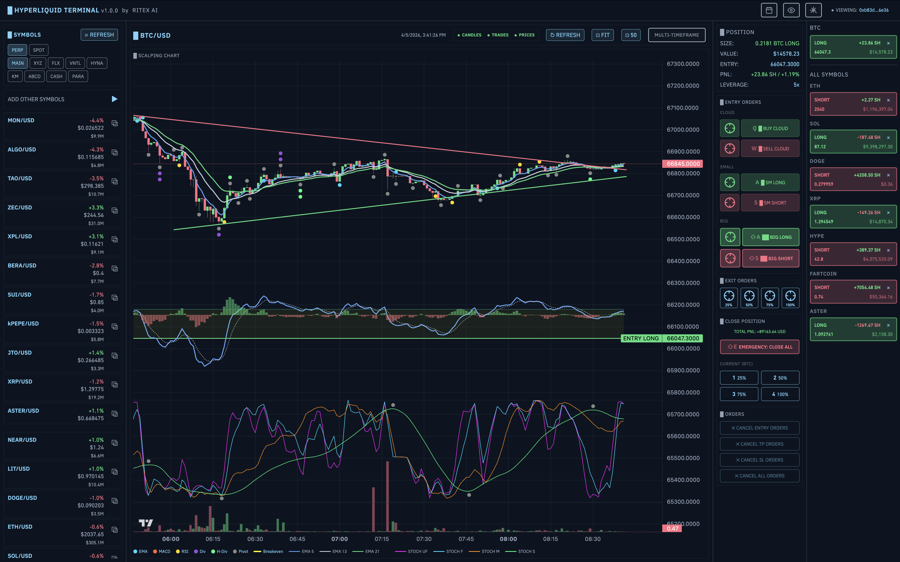

<div align="center">

# RITEX AI

### Nền Tảng Giao Dịch Scalping Chuyên Nghiệp cho Hyperliquid DEX

[](https://ritexai.com)
[](https://github.com/Dinoxv/ritex-ai)
[](#)
[](#)
[](#)



**15K+ dòng TypeScript · 16 Zustand Stores · 25+ Components · 25+ Chỉ báo · 8 Scanner · 20+ Giao diện**

100% xử lý tại trình duyệt — Khóa riêng không bao giờ rời khỏi máy bạn.

[Truy cập ngay →](https://ritexai.com) · [Xem Demo](https://ritexai.com)

</div>

---

## 1. Tổng quan

**RITEX AI** là nền tảng giao dịch scalping chuyên nghiệp kết nối trực tiếp đến [Hyperliquid DEX](https://hyperliquid.xyz). Kiến trúc phân tầng rõ ràng, TypeScript strict mode toàn bộ, xử lý hoàn toàn phía trình duyệt. Không máy chủ trung gian, không thu thập dữ liệu.

| | Đặc điểm | Mô tả |
|---|---|---|
| 🔒 | **Bảo mật tuyệt đối** | Khóa riêng được mã hóa cục bộ, không bao giờ truyền đi |
| ⚡ | **Tốc độ thời gian thực** | WebSocket trực tiếp, cập nhật biểu đồ và giá tức thì |
| 📊 | **Phân tích chuyên sâu** | 25+ chỉ báo kỹ thuật, phát hiện phân kỳ tự động |
| 🔍 | **Quét thị trường** | 8 scanner module quét toàn bộ thị trường tìm tín hiệu |
| 🌐 | **Đa ngôn ngữ** | Tiếng Việt, English, 中文 |

---

## 2. Kiến trúc hệ thống

Kiến trúc 4 tầng với phân tách trách nhiệm rõ ràng:

```
┌─────────────────────────────────────────────────────────┐
│  UI Layer                                                │
│  ScalpingChart · IndicatorSignals · Scanner · Orders     │
│  Watchlist · SymbolOverview · PerformanceTracking        │
├─────────────────────────────────────────────────────────┤
│  State Layer                                             │
│  useTradingStore · useCandleStore · usePositionStore     │
│  useOrderStore · useScannerStore ... (16+ stores)        │
├─────────────────────────────────────────────────────────┤
│  Service Layer                                           │
│  HyperliquidService · ScannerService · Singleton Caches  │
├─────────────────────────────────────────────────────────┤
│  Transport Layer                                         │
│  WebSocket + HTTP via @nktkas/hyperliquid SDK             │
└─────────────────────────────────────────────────────────┘
```

### Tầng Transport
- **@nktkas/hyperliquid SDK** — kết nối WebSocket và REST API
- Singleton `HyperliquidService` quản lý lifecycle kết nối
- Lazy WebSocket: kết nối mở khi cần, không mở lúc app load

### Tầng State
- **16+ Zustand stores** — mỗi store một trách nhiệm
- `useTradingStore`, `useCandleStore`, `usePositionStore`, `useOrderStore`, `useScannerStore`...
- Selector-based subscriptions tránh re-render không cần thiết

### Tầng UI
- **ScalpingChart** — TradingView lightweight-charts với overlay chỉ báo
- Component tree tối ưu với React.memo và useMemo
- 20+ theme tùy chỉnh (Terminal Green, Synthwave, Cyberpunk, Matrix...)

---

## 3. Chỉ báo kỹ thuật

> Hàm thuần (pure functions) không side effects. 2000+ dòng code phân tích đã được kiểm nghiệm.

### Xu hướng (Trend)
| Chỉ báo | Chi tiết |
|---|---|
| EMA | Bất kỳ chu kỳ (5, 20, 50...) |
| MACD | Tham số tùy chỉnh |
| Kênh Keltner | ATR-based bands |
| Kênh Donchian | High/Low breakout |
| Phát hiện đường xu hướng | Pivot-based trendlines |

### Động lực (Momentum)
| Chỉ báo | Chi tiết |
|---|---|
| RSI | Chu kỳ tùy chỉnh |
| Stochastic | 4 biến thể (%K, %D, full) |
| ATR | Average True Range |
| Volume Flow | Phân tích khối lượng |
| RSI Volatility | RSI kết hợp biến động |

### Nhận dạng mẫu hình (Pattern)
| Mẫu hình | Chi tiết |
|---|---|
| Pivot High/Low | Phát hiện đỉnh/đáy |
| Hỗ trợ/Kháng cự | Tự động xác định vùng giá |
| Kênh giá | Phát hiện kênh tăng/giảm |
| EMA đồng hướng | Alignment đa EMA |
| Đảo chiều | MACD/RSI/Stochastic reversal |

### ⚡ Phát hiện phân kỳ (Divergence)
Phân kỳ thường & ẩn trên RSI, MACD, Stochastic. Ngưỡng ATR động tự động lọc nhiễu. Hỗ trợ đa khung thời gian với chấm điểm độ tin cậy.

---

## 4. Luồng giao dịch

### ☁️ Cloud Orders
5 lệnh giới hạn trải đều theo khoảng giá. DCA chính xác vào vị thế với interval tùy chỉnh.

### ⚡ Market Orders
SM Long/Short, Big Long/Short — lệnh IOC limit theo % giá trị tài khoản. Thực hiện tức thì.

### 🛡️ TP/SL Orders
Cắt lỗ & chốt lời tự động. Dịch chuyển SL thông minh theo % từ giá hiện tại.

### 🚀 Optimistic UI
Lệnh hiển thị ngay trước khi API xác nhận. Tự hoàn tác khi lỗi. Độ trễ bằng không.

---

## 5. Tối ưu hiệu năng

| # | Kỹ thuật | Chi tiết |
|---|---|---|
| 01 | **RAF Throttling** | Cập nhật biểu đồ qua requestAnimationFrame — 60fps mượt mà |
| 02 | **Memoization** | Kết quả chỉ báo cached theo dấu vân tay nến. Chỉ tính lại khi dữ liệu thay đổi |
| 03 | **Virtual Scrolling** | Chỉ render item đang hiển thị. 200+ symbol, ~10 DOM nodes |
| 04 | **Debounced Analysis** | Phát hiện phân kỳ O(n²) chỉ chạy khi nến ổn định |
| 05 | **Service Caching** | Singleton cache với TTL cho số dư và metadata |
| 06 | **Lazy WebSocket** | Kết nối mở khi cần, không mở lúc app load |

---

## 6. Công nghệ

| Thành phần | Công nghệ | Phiên bản |
|---|---|---|
| Framework | Next.js (Turbopack) | 16 |
| UI Library | React | 19 |
| Language | TypeScript (strict) | 5 |
| Styling | TailwindCSS | 4 |
| State | Zustand | 5 |
| Charts | TradingView lightweight-charts | 4.2 |
| API | @nktkas/hyperliquid SDK | 0.32 |
| Data | WebSocket + REST | Real-time |
| Font | BinancePlex | Local |
| i18n | Custom Zustand-based | en/vi/zh |

---

## 7. Tính năng nổi bật

| Tính năng | Chi tiết |
|---|---|
| **Biểu đồ nến** | TradingView lightweight-charts, overlay chỉ báo, đa khung thời gian |
| **Quét thị trường** | 8 scanner module: Stochastic cực đoan, EMA alignment, Volume spike, Divergence... |
| **Đặt lệnh trên biểu đồ** | Click chính xác vị trí giá, kéo thả TP/SL |
| **Phím tắt** | Ctrl+K tìm cặp, phím số đặt lệnh, Escape hủy |
| **Đa màn hình** | Pop-out biểu đồ ra cửa sổ riêng |
| **Theo dõi hiệu suất** | P&L ngày/tháng, tỷ lệ thắng, profit factor, phí |
| **Watchlist** | Theo dõi ví trader khác |
| **20+ Theme** | Terminal Green, Synthwave, Amber, Cyberpunk, Matrix... |

---

## 8. Bắt đầu

### Yêu cầu
- Node.js 18+
- Địa chỉ ví Hyperliquid

### Cài đặt

```bash
git clone https://github.com/Dinoxv/ritex-ai.git
cd ritex-ai
npm install
```

### Phát triển

```bash
npm run dev
```

Truy cập tại [http://localhost:3001](http://localhost:3001)

### Production

```bash
npm run build
npm start
```

### Deploy với PM2

```bash
pm2 start ecosystem.config.js
```

### Smoke test đa sàn (QA production/testnet)

File mẫu biến môi trường:

```bash
cp .env.smoke.example .env.smoke
```

Profile mặc định (public checks + private checks ở chế độ skip nếu thiếu credential):

```bash
bash scripts/smoke-public.sh
```

Profile private bắt buộc env (fail sớm nếu thiếu biến):

```bash
bash scripts/smoke-private.sh
```

### Tích hợp PM2 deploy hook

Ví dụ script hậu deploy để build + smoke private + reload PM2:

```bash
#!/usr/bin/env bash
set -euo pipefail

cd /root/hyperscalper
npm ci
npm run build
bash scripts/smoke-private.sh
pm2 reload ecosystem.config.js --only hyperscalper-frontend
```

Khuyến nghị: nếu smoke trả exit code khác 0 thì dừng deploy.

### Tích hợp cron health check

Ví dụ chạy mỗi 15 phút, ghi log và giữ exit code để alert:

```bash
*/15 * * * * cd /root/hyperscalper && bash scripts/smoke-public.sh >> /var/log/hyperscalper-smoke.log 2>&1
```

Ví dụ profile private chạy theo lịch thưa hơn:

```bash
0 */6 * * * cd /root/hyperscalper && bash scripts/smoke-private.sh >> /var/log/hyperscalper-smoke-private.log 2>&1
```

Script smoke có summary dạng bảng và exit code chi tiết theo từng flow, phù hợp để tích hợp hệ thống giám sát.

### Troubleshooting smoke exit codes

| Exit code | Nguyên nhân | Cách xử lý nhanh |
|---|---|---|
| `11` | Lỗi flow credentials storage | Kiểm tra logic tách key credentials trong localStorage (`hyperliquid_credentials`, `binance_credentials`, `hyperscalper_credentials`). |
| `21` | Thiếu env bắt buộc cho profile private | Kiểm tra `.env.smoke` đã có đủ `SMOKE_HYPER_WALLET_ADDRESS`, `SMOKE_BINANCE_API_KEY`, `SMOKE_BINANCE_API_SECRET` (và `SMOKE_HYPER_PRIVATE_KEY` nếu bật live close). |
| `31` | Hyperliquid public checks fail | Kiểm tra kết nối mạng/API Hyperliquid, `SMOKE_HYPER_TESTNET`, symbol (`SMOKE_HYPER_SYMBOL`). |
| `32` | Hyperliquid private checks fail | Kiểm tra wallet address/key, quyền giao dịch, trạng thái vị thế/lệnh testnet. |
| `41` | Binance public checks fail | Kiểm tra kết nối tới Binance Futures endpoint, `SMOKE_BINANCE_TESTNET`, symbol (`SMOKE_BINANCE_SYMBOL`). |
| `42` | Binance private checks fail | Kiểm tra API key/secret, quyền Futures (read/trade), IP whitelist và trạng thái tài khoản testnet. |
| `99` | Lỗi không phân loại | Kiểm tra log summary trong output script để xác định flow fail đầu tiên, sau đó rerun bằng profile tương ứng. |

---

## 9. Cấu trúc dự án

```
ritex-ai/
├── app/                    # Next.js App Router
│   ├── [address]/          # Trang giao dịch chính
│   ├── layout.tsx          # Layout + SEO
│   └── page.tsx            # Landing page
├── components/             # 25+ React components
│   ├── chart/              # ScalpingChart, Indicators
│   ├── trading/            # Orders, TP/SL, Cloud
│   ├── scanner/            # Scanner modules
│   └── layout/             # AppShell, Navigation
├── stores/                 # 16+ Zustand stores
├── lib/
│   ├── indicators.ts       # 2000+ lines phân tích kỹ thuật
│   ├── i18n/               # Đa ngôn ngữ (en/vi/zh)
│   ├── services/           # HyperliquidService, ScannerService
│   └── websocket/          # WebSocket managers
├── hooks/                  # React hooks
└── types/                  # TypeScript types
```

---

## Tác giả

Phát triển bởi **RITEX AI** — [ritexai.com](https://ritexai.com)

## Giấy phép

Chỉ sử dụng cá nhân.

## Tuyên bố miễn trừ

⚠️ Phần mềm BETA. Giao dịch tiền mã hóa có rủi ro tổn thất tài chính đáng kể. Hiệu suất quá khứ không đảm bảo kết quả tương lai. Sử dụng theo rủi ro của bạn.
