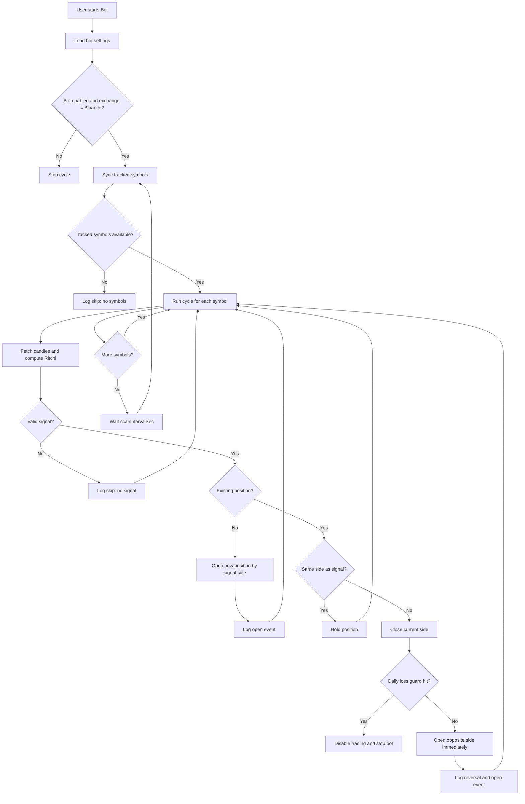
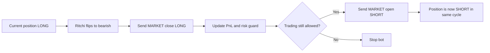
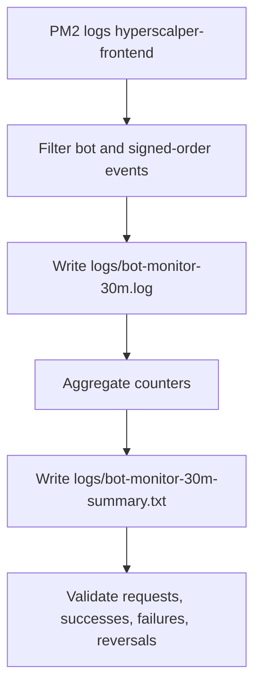
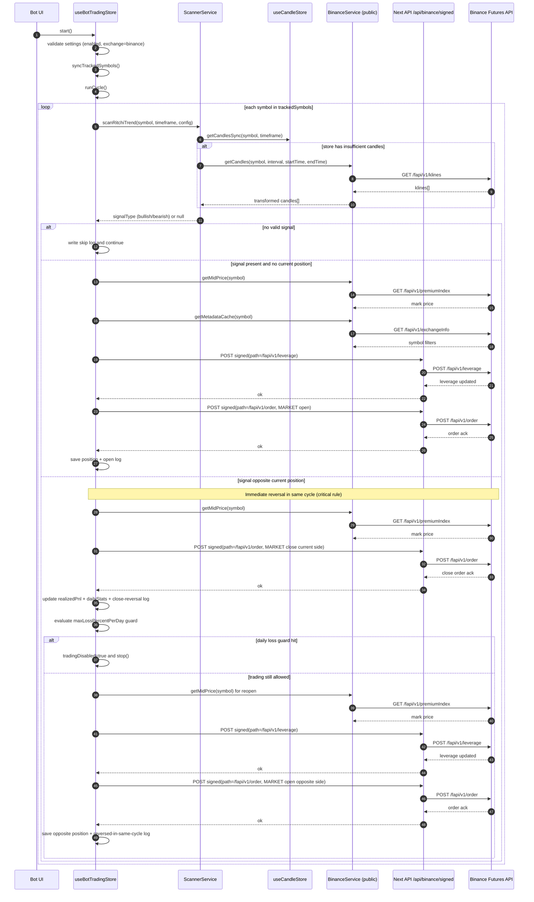
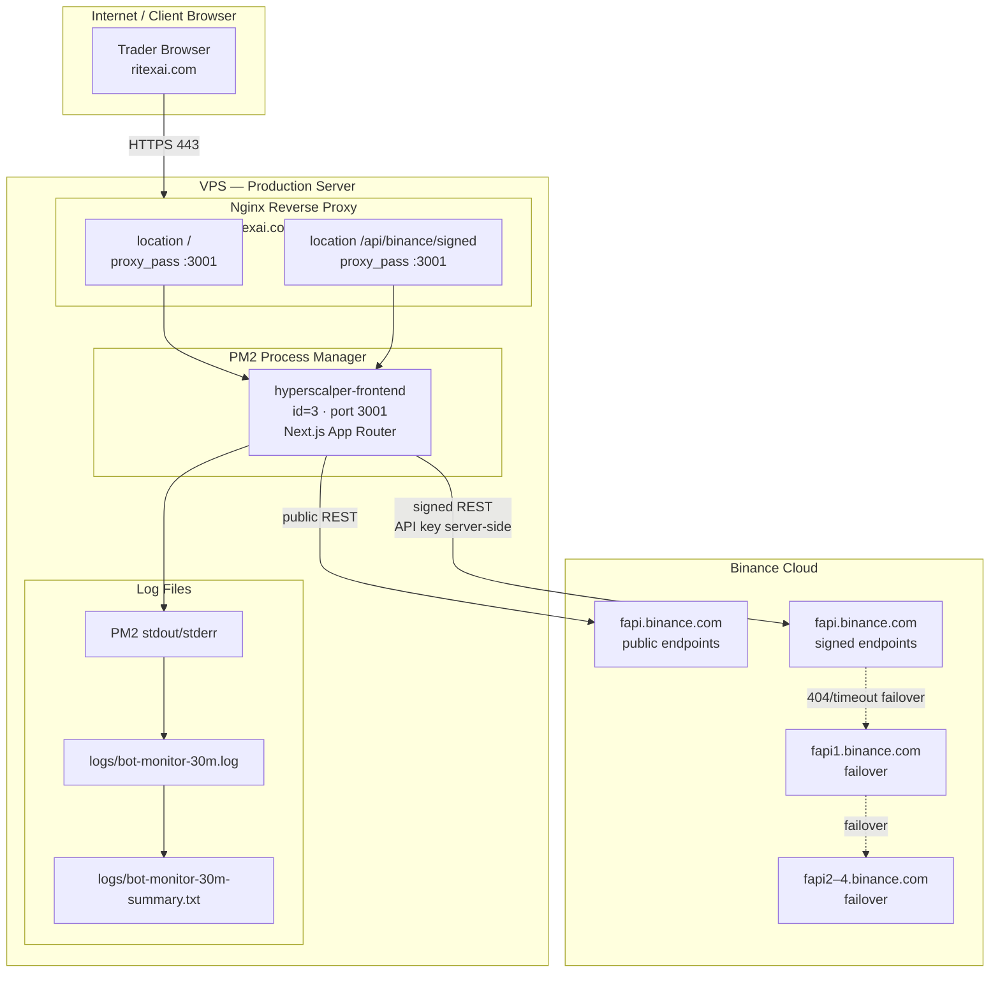
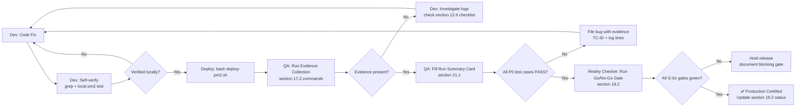

# BotTrading Binance — Phase 1 Audit & System Reference

**Version**: 1.5.0  
**Date**: 2026-05-02  
**Branch**: `feat/bot-trading-release-ready`  
**Author**: System Audit (Copilot — full source sync)

---

## Changelog

| Version | Date | Changes |
|---------|------|---------|
| 1.5.0 | 2026-05-02 | Comprehensive developer reference update: full runCycle() decision tree (§24), store interface quick reference + state machine diagrams (§25), expanded reversal operability with code snippets + sơ đồ luồng đầy đủ (§23.4–23.5) |
| 1.4.0 | 2026-05-02 | Reversal operability improvements: periodic reconcile job (§23), `reversalPendingVerification` symbol flag + UI badge (§23), structured log fields `closePrice`/`openPrice`/`slippageBps` on `BotLogEntry` (§23) |
| 1.3.0 | 2026-04-30 | Full source sync: corrected all line refs, added multi-indicator support (kalmanTrend, macdReversal), backtest feature (§ new), auto-rotation logic, signed proxy ALLOWED_SIGNED_PATHS, persist key, store interface table |
| 1.2.0 | 2026-04-30 | Enhanced with agency-agents patterns: Evidence Collection Protocol (§17), Binance API Test Contracts / OWASP checks (§18), Production Readiness Go/No-Go Gate (§19), Performance Benchmarks & SLA targets (§20), Test Results Analysis Template (§21), Dev→QA Workflow SOP with Mermaid (§22) |
| 1.1.0 | 2026-04-30 | Added full worklog update: signed API routing fixes, mobile bot UI updates, signal/reversal logic fixes, and 30-minute monitoring procedure |
| 1.0.0 | 2026-04-30 | Initial audit — Phase 1 production verified |

---

## 1. Overview

Bot trading Binance USDⓈ-M Futures chạy browser-side, quản lý bởi Zustand store `useBotTradingStore`.  
Default indicator: **Ritchi Trend (Siêu Xu Hướng)** — timeframe `1m`, scan theo `scanIntervalSec` (default 30s, min 5s), auto track top-N volatile symbols theo `autoTopSymbolsCount` (default 3).

**Supported indicators** (`BotIndicatorType`): `ritchi` | `kalmanTrend` | `macdReversal`  
**Route**: `/binance-apikey/bot`  
**PM2 process**: `hyperscalper-frontend` (id=3), port 3001  
**Zustand persist key**: `ritex-bot-runtime` (persists only `keepRunning` field)  
**Max log entries**: 500 (`MAX_LOGS`)

---

## 2. Default Bot Settings

| Setting | Default Value | Type | Notes |
|---------|---------------|------|-------|
| `enabled` | `false` | boolean | User must toggle on |
| `indicator` | `'ritchi'` | `BotIndicatorType` | `ritchi` \| `kalmanTrend` \| `macdReversal` |
| `paperMode` | `false` | boolean | `start()` forces `false` — live orders always |
| `exchange` | `'binance'` | `BotExchange` | `start()` forces `'binance'` |
| `timeframe` | `'1m'` | `'1m'\|'5m'` | Candle timeframe for scanner |
| `scanIntervalSec` | `30` | number | Clamped: `Math.max(5, scanIntervalSec)` |
| `autoTopSymbolsCount` | `3` | number (1–10) | Top N volatile symbols to track in auto mode |
| `initialMarginUsdt` | `25` | number | Margin per position (USDT) |
| `maxLossPercentPerDay` | `3` | number (%) | Daily loss guard — disables bot when hit |
| `leverageByExchange.binance` | `10` | number | Leverage used for Binance orders |
| `leverageByExchange.hyperliquid` | `10` | number | (not used in bot, kept for parity) |
| `symbolMode` | `'auto'` | `BotSymbolMode` | `'auto'` \| `'manual'` |
| `manualSymbols` | `[]` | string[] | Symbol list when `symbolMode='manual'` |

**Notional per position**: `initialMarginUsdt × leverage = 25 × 10 = 250 USDT`  
**Source**: `models/Settings.ts` → `DEFAULT_SETTINGS.bot`

---

## 3. Ritchi Trend (Siêu Xu Hướng) Default Config

| Param | Default | Scanner use | Description |
|-------|---------|-------------|-------------|
| `pivLen` | 5 | `config.pivLen` | Pivot lookback length. Also controls base lookback `pivLen + 2` |
| `smaMin` | 5 | `config.smaMin` | SMA minimum period |
| `smaMax` | 50 | `config.smaMax` | SMA maximum period |
| `smaMult` | 1.0 | `config.smaMult` | SMA multiplier (default to 1.0 if undefined) |
| `trendLen` | 100 | `config.trendLen` | Trend length (default to 100 if undefined) |
| `atrMult` | 2.0 | `config.atrMult` | ATR multiplier for stop loss (default to 2.0 if undefined) |
| `tpMult` | 3.0 | `config.tpMult` | Take profit multiplier (default to 3.0 if undefined) |

Config source: `models/Settings.ts` → `DEFAULT_SETTINGS.indicators.sieuXuHuong`  
Bot uses: `settings.indicators.sieuXuHuong` passed into `scanRitchiTrend()` config  
Implementation: `lib/indicators.ts` → `calculateSieuXuHuong(candles, pivLen, smaMin, smaMax, smaMult, trendLen, atrMult, tpMult)`  

**Signal detection logic** (`scanner.service.ts → scanRitchiTrend`):
- Phase 1 (crossover): check `buySignals/sellSignals` in last `signalLookback = max(pivLen + 2, 10)` bars
- Phase 2 (fallback): if no crossover, require both:
  - mature trend: `trendAge >= max(0.2, min(0.35, 20 / trendLen))`
  - direction stability: last 4 bars have same `direction[lastIndex]`
- Description tag: `crossover` or `trend-direction` in scan result

---

## 4. Full Trading Pipeline

```
start()
  ├── force: exchange='binance', paperMode=false (if not already set)
  ├── clear existing intervalId
  ├── set: isRunning=true, keepRunning=true
  ├── syncTrackedSymbols()
  ├── log 'Bot started'
  ├── runCycle() immediately
  └── setInterval(Math.max(5, scanIntervalSec) * 1000) → runCycle()

stop()
  ├── clearInterval
  ├── set: isRunning=false, intervalId=null, isExecuting=false, keepRunning=false
  └── log 'Bot stopped'

runCycle()
  ├── Guard: service && scannerService && !isExecuting (skip if any missing)
  ├── Guard: botSettings.enabled === true
  ├── Guard: botSettings.exchange === 'binance'
  ├── Day rollover: if dailyStats.dayKey !== today → reset dailyStats
  ├── Guard: !dailyStats.tradingDisabled
  │     └── if disabled → log dedup 'Daily loss limit reached' (once per disable)
  ├── syncTrackedSymbols()
  │     ├── symbolMode='auto' → getTopVolatileSymbols(autoTopSymbolsCount)
  │     │     + keepOpen: positions outside desired list (close them first)
  │     │     └── trackedSymbols = [...keepOpen, ...desired]
  │     └── symbolMode='manual' → trackedSymbols = manualSymbols
  ├── Guard: trackedSymbols.length > 0 (log dedup if empty)
  │
  └── for each symbol in trackedSymbols:
      │
      ├── [Auto rotation guard]
      │   If symbolMode='auto' AND there are out-of-top open positions:
      │     Skip opening new desired symbols until those positions close first
      │
      ├── Signal scan (based on botSettings.indicator):
      │   ├── 'ritchi'
      │   │   └── scannerService.scanRitchiTrend(symbol, timeframe, sieuXuHuong config)
      │   │         ├── getCandlesFromStore(symbol, timeframe, 150)
      │   │         ├── if < 50 candles → fetchCandlesDirect() → GET /fapi/v1/klines
      │   │         ├── calculateSieuXuHuong(candles, pivLen, smaMin, smaMax, smaMult, trendLen, atrMult, tpMult)
      │   │         ├── Phase 1: recentBuy/Sell in last max(pivLen+2, 10) bars
      │   │         └── Phase 2: fallback trendFallback only when trend is mature + direction stable (last 4 bars)
      │   ├── 'kalmanTrend'
      │   │   └── scannerService.scanKalmanTrend(symbol, timeframe, kalmanTrendScanner config)
      │   └── 'macdReversal'
      │       └── scannerService.scanMacdReversal(symbol, timeframe, macdReversalScanner config)
      │
      ├── No signal → log skip 'No signal — indicator returned null (candles unavailable or no crossover)'
      │
      ├── Signal + No existing position → OPEN
      │   ├── getMidPrice(symbol) → GET /fapi/v1/premiumIndex
      │   ├── Guard: midPrice is finite and > 0
      │   ├── notional = initialMarginUsdt × leverageByExchange.binance
      │   ├── rawSize = notional / midPrice
      │   ├── [live only] getMetadataCache(symbol) [stepSize, tickSize, minNotional]
      │   ├── [live only] setLeverage(symbol, leverage) → POST /fapi/v1/leverage
      │   ├── [live only] ensureMinNotional(rawSize, midPrice, metadata, 10)
      │   ├── [live only] placeMarketBuy/Sell → POST /fapi/v1/order (via signed proxy)
      │   └── set positions[symbol], dailyStats.totalTradedNotional += notional
      │         log 'Opened LONG/SHORT from {indicator} signal'
      │
      ├── Signal + Same side as existing → hold, no action
      │
      └── Signal + Opposite side → CLOSE then immediately REOPEN (same cycle)
          ├── getMidPrice → closePrice
          ├── [live only] placeMarketSell/Buy (close) → POST /fapi/v1/order MARKET
          ├── calc realizedPnl = (closePrice - entryPrice) × size  (×-1 if short)
          ├── update dailyStats: +closeNotional, +realizedPnl
          ├── calc nextLoss = max(0, -nextRealizedPnl)
          ├── maxLossUsd = (totalTradedNotional × maxLossPercentPerDay) / 100
          ├── hitDailyLoss = maxLossUsd > 0 && nextLoss >= maxLossUsd
          ├── set positions (remove symbol), tradingDisabled = hitDailyLoss
          │     log 'Closed LONG/SHORT due to reversal signal'
          ├── if hitDailyLoss → toast error + get().stop() + break symbol loop
          └── if !hitDailyLoss → immediately OPEN opposite side
                getMidPrice → openPrice
                [live] setLeverage + ensureMinNotional + placeMarketBuy/Sell
                set positions[symbol] (new side), log 'Reversed to LONG/SHORT in same cycle'
```

---

## 5. Symbol Selection

```
useGlobalPollingStore.fetchSlowData() [every 90s on Binance]
  └── BinanceService.getMetaAndAssetCtxs()
        ├── GET /fapi/v1/ticker/24hr    → dayNtlVlm, prevDayPx, midPx
        └── GET /fapi/v1/premiumIndex   → markPx
  └── useSymbolVolatilityStore.updateFromGlobalPoll(metaData)
        └── percentChange = (markPx - prevDayPx) / prevDayPx × 100  [ALL symbols]
  └── useTopSymbolsStore.updateFromGlobalPoll(metaData)
        └── sort by dayNtlVlm desc

getTopVolatileSymbols()
  └── useTopSymbolsStore.symbols ranked by |volatility[name].percentChange| desc
  └── return top N names (`N = autoTopSymbolsCount`)
```

> **Fix v1.0**: `updateFromGlobalPoll` đã bỏ filter `subscribedSymbols` — tất cả symbols trong universe đều được tính volatility, không chỉ những symbol đang mở trên chart.

---

## 6. Key Files

| File | Role |
|------|------|
| `app/[address]/bot/page.tsx` | Route entry — redirect non-binance slugs → `/binance-apikey/bot` |
| `components/layout/AppShell.tsx` | Nav button Bot → always push `/${BINANCE_ROUTE_SLUG}/bot` |
| `components/BotTradingView.tsx` | Bot UI panel — controls, logs, positions, backtest |
| `stores/useBotTradingStore.ts` | Bot engine — lifecycle, scan cycle, order placement, backtest |
| `stores/useSettingsStore.ts` | App settings store — `settings.bot`, `settings.indicators.sieuXuHuong` |
| `stores/useSymbolVolatilityStore.ts` | Volatility tracker — percentChange per symbol |
| `stores/useTopSymbolsStore.ts` | Universe ranked by volume (dayNtlVlm) |
| `stores/useCandleStore.ts` | Candle cache — `getCandlesFromStore()`, `getClosePrices()` |
| `stores/useGlobalPollingStore.ts` | Poll meta/prices every 90s (Binance) |
| `stores/useDexStore.ts` | Selected exchange state — checked in backtest path |
| `lib/services/binance.service.ts` | Binance Futures REST service (`/fapi/v1/...`) |
| `lib/services/scanner.service.ts` | `scanRitchiTrend()`, `scanKalmanTrend()`, `scanMacdReversal()` |
| `lib/indicators.ts` | `calculateSieuXuHuong()`, `calculateKalmanTrend()`, `calculateMACD()` |
| `lib/time-utils.ts` | `INTERVAL_TO_MS` — timeframe → ms for backtest window calc |
| `app/api/binance/signed/route.ts` | Server-side signed proxy — HMAC sign, host failover, audit logs |
| `models/Settings.ts` | All default settings, `BotTradingSettings`, `SieuXuHuongSettings` |
| `models/Scanner.ts` | `RitchiTrendValue`, `ScanResult` types |
| `components/providers/ServiceProvider.tsx` | Wires `exchangeService` to all stores |

---

## 7. Binance API Endpoints Used

### 7.1 Public Endpoints (direct browser → Binance)

| Method | Endpoint | Purpose |
|--------|----------|---------|
| GET | `/fapi/v1/klines` | Fetch OHLCV candles for indicator calc |
| GET | `/fapi/v1/premiumIndex` | Get mark price (`getMidPrice`) |
| GET | `/fapi/v1/ticker/24hr` | dayNtlVlm + prevDayPx for volatility calc |
| GET | `/fapi/v1/exchangeInfo` | Symbol metadata (stepSize, tickSize, minNotional) |

### 7.2 Signed Endpoints (browser → Next.js `/api/binance/signed` → Binance)

Server-side signed proxy (`app/api/binance/signed/route.ts`) only allows these paths:

| Method | Allowed Path | Purpose |
|--------|-------------|---------|
| POST | `/fapi/v1/positionSide/dual` | Set hedge mode (dual position side) |
| POST, DELETE | `/fapi/v1/order` | Place / cancel MARKET order |
| GET, DELETE | `/fapi/v1/openOrders` | List / cancel all open orders |
| GET | `/fapi/v1/userTrades` | Trade history |
| DELETE | `/fapi/v1/allOpenOrders` | Cancel all open orders for symbol |
| POST | `/fapi/v1/leverage` | Set leverage per symbol (before each order) |
| GET | `/fapi/v2/account` | Account balance and margin info |
| GET | `/fapi/v2/positionRisk` | Open positions from Binance side |

### 7.3 Host Failover (Signed Proxy)

Mainnet USDM hosts tried in order:
```
https://fapi.binance.com
https://fapi1.binance.com
https://fapi2.binance.com
https://fapi3.binance.com
https://fapi4.binance.com
```

Testnet (`isTestnet=true`):
```
https://demo-fapi.binance.com
https://testnet.binancefuture.com
```

DAPI (COIN-M) fallback paths available for selected `/fapi/v2/account`, `/fapi/v2/positionRisk`, `/fapi/v1/leverage` etc. via `FAPI_TO_DAPI_FALLBACK_PATHS` map.

---

## 8. Risk Controls

| Control | Behavior |
|---------|----------|
| `maxLossPercentPerDay = 3%` | After each close, calc `nextLoss = max(0, -realizedPnl)`. `maxLossUsd = (totalTradedNotional × maxLossPercentPerDay) / 100`. If `nextLoss >= maxLossUsd` → `tradingDisabled=true`, bot stops, toast error. Guard activates next cycle too (log dedup). |
| `paperMode = false` | `start()` forces `paperMode=false` — live orders always. No-op branch exists in code for `isPaperMode=true` but runtime never activates it. |
| `maxPositions` | Implicit: tracks only `trackedSymbols` (default top-3, configurable via `autoTopSymbolsCount`). One position per symbol in `positions` map. |
| Signal gate | Open only when valid signal: crossover in last `max(pivLen+2, 10)` bars OR established trend-direction fallback (mature trend + 4-bar stable direction). |
| Leverage set per order | `setLeverage(symbol, leverage, metadata)` called before each open (including reversal re-open). |
| Auto rotation delay | When top-N symbols change, new desired symbols are delayed from opening until out-of-top open positions close. |
| `isExecuting` guard | Prevents concurrent `runCycle()` calls. Set true at start, cleared in finally block. |
| Day rollover | `dailyStats` resets automatically when `dayKey !== today`. `tradingDisabled` clears next day. |

### Critical Rule: No Fixed TP/SL, Exit by Ritchi Reversal Only

This strategy does not rely on fixed take-profit or stop-loss orders on Binance.

1. Position management is signal-driven by Ritchi Trend.
2. When Ritchi signal flips (`bullish -> bearish` or `bearish -> bullish`), bot must reverse immediately.
3. Reverse execution on Binance must happen in the same cycle:
  - close current side,
  - open opposite side right away.
4. Any delayed reversal (waiting for next cycle) is considered invalid strategy behavior because TP/SL control depends on indicator reversal.

---

## 9. Known Behaviors & Notes

1. **`useDexStore.selectedExchange` mặc định `'hyperliquid'`** — chỉ ảnh hưởng polling interval (5s vs 12s). Không ảnh hưởng bot trading.

2. **Backtest và `useDexStore.selectedExchange`**: `runRitchiBacktest()` kiểm tra `useDexStore.selectedExchange === 'binance'` — nếu user muốn backtest cần exchange dropdown đang là Binance.

3. **Auto symbol rotation**: Khi top-N thay đổi, bot delay open vị thế mới cho đến khi các vị thế nằm ngoài desired list được đóng. `desiredAutoSymbols` chứa danh sách `autoTopSymbolsCount` mới nhất.

4. **Symbol normalization**: `normalizeBinanceSymbolInput('SKYUSDT') → 'SKY'` (strips `/USDT` or `USDT` suffix). Used in manual backtest symbol input parsing.

5. **`keepRunning` persist**: Zustand persist key `'ritex-bot-runtime'` only saves `keepRunning:boolean`. All other state (positions, logs, dailyStats, trackedSymbols) is **lost on page refresh**. On reload, `ServiceProvider.ensureAutoResume()` calls `useBotTradingStore.ensureAutoResume()` which restarts bot if `keepRunning=true`.

6. **Scan interval minimum**: `scanIntervalSec` is clamped to `Math.max(5, scanIntervalSec)` in `start()`. Values below 5s are silently raised to 5s.

7. **Log dedup**: Some log messages (e.g., 'Daily loss limit reached', 'No tracked symbols') are only added once per condition to avoid log spam. Tracked via `_lastLogDedupKey`.

8. **Indicator config fallback**: Scanner uses `?? default` for all Ritchi config params. If `sieuXuHuong` settings are partially undefined, safe defaults apply (atrMult=2.0, tpMult=3.0, trendLen=100, smaMult=1.0).

9. **Fallback anti-churn guard**: `scanRitchiTrend()` no longer emits fallback early (`trendAge >= 0.03`). It now requires mature trend age and 4-bar direction stability before emitting `trend-direction` signal.

10. **`closeAllPositionsNow()`**: Immediately places MARKET close for all tracked positions and clears `positions` map. Separate from `stop()` — `stop()` only stops cycle, does not close positions.

11. **`MAX_LOGS = 500`**: When log array exceeds 500 entries, oldest entries are dropped. `importLogs()` can bulk-load logs (used for session restore from export).

## 9a. Bot Backtest Feature

### 9a.1 Overview

`useBotTradingStore` supports two backtest functions using historical Binance candles:

| Function | Description |
|----------|-------------|
| `runRitchiBacktest(bars?)` | Run single backtest with current `sieuXuHuong` config |
| `runRitchiBacktestPresetCompare(bars?)` | Run 3 preset comparisons side-by-side |

Default `bars = 600`. Allowed range: **120 to 5000**.

### 9a.2 Preset Configs

| Preset | pivLen | smaMin | smaMax | smaMult | trendLen | atrMult | tpMult |
|--------|--------|--------|--------|---------|----------|---------|--------|
| Conservative | 7 | 8 | 60 | 1.2 | 120 | 2.5 | 4.0 |
| Balanced | 5 | 5 | 50 | 1.0 | 100 | 2.0 | 3.0 |
| Aggressive | 3 | 3 | 30 | 0.8 | 80 | 1.5 | 2.0 |

### 9a.3 Backtest Result Metrics

```typescript
BotBacktestResult {
  trades: number            // total trades (open+close pairs)
  wins: number
  losses: number
  winRate: number           // wins / trades
  totalPnl: number          // USDT
  avgPnl: number            // totalPnl / trades
  maxDrawdown: number       // USDT, worst peak-to-trough
  profitFactor: number      // grossProfit / grossLoss
  bySymbol: Record<string, { trades, wins, totalPnl }>
}

BotBacktestPresetResult {
  preset: 'Conservative' | 'Balanced' | 'Aggressive'
  config: Partial<SieuXuHuongSettings>
  result: BotBacktestResult
}
```

### 9a.4 Backtest Flow

```
runRitchiBacktest(bars)
  ├── validate bars range [120, 5000]
  ├── fetch candles for each trackedSymbol via BinanceService.getCandles(bars)
  ├── simulate reversal-on-signal strategy
  │     ├── for each bar: calculateSieuXuHuong() on candles[0..i]
  │     ├── open on signal, reverse on opposite signal
  │     └── track PnL with initialMarginUsdt × leverage sizing
  ├── set isBacktesting=true during run, false after
  └── set backtestResult (or backtestPresetResults for preset compare)
```

---

## 9b. Store Interface Reference (`useBotTradingStore`)

### 9b.1 Key State Fields

| Field | Type | Description |
|-------|------|-------------|
| `isRunning` | boolean | Cycle is active |
| `keepRunning` | boolean | **Persisted** — used to resume on reload |
| `isExecuting` | boolean | Currently inside `runCycle()` |
| `isBacktesting` | boolean | Backtest in progress |
| `trackedSymbols` | string[] | Current symbols being scanned |
| `desiredAutoSymbols` | string[] | Target top-N auto symbols (before rotation) |
| `positions` | Record<string, BotTrackedPosition> | Open bot positions |
| `logs` | BotLogEntry[] | Last 500 log entries |
| `dailyStats` | BotDailyStats | Daily P&L and loss guard |
| `backtestResult` | BotBacktestResult \| null | Last single backtest result |
| `backtestPresetResults` | BotBacktestPresetResult[] | Last preset compare results |

### 9b.2 Key Action Methods

| Method | Description |
|--------|-------------|
| `start()` | Start bot cycle, force `exchange='binance'`, `paperMode=false` |
| `stop()` | Stop cycle, clear interval, set `keepRunning=false` |
| `runCycle()` | One scan+trade iteration for all tracked symbols |
| `syncTrackedSymbols()` | Update `trackedSymbols` from top-N or manual list |
| `closeAllPositionsNow()` | Market-close all open positions immediately |
| `closePositionNow(symbol)` | Market-close one specific position |
| `toggleManualSymbol(symbol)` | Add/remove symbol from manual symbol list |
| `runRitchiBacktest(bars?)` | Run single backtest with current config |
| `runRitchiBacktestPresetCompare(bars?)` | Run Conservative/Balanced/Aggressive presets |
| `ensureAutoResume()` | Called on page load: resume bot if `keepRunning=true` |
| `importLogs(logs)` | Bulk import log entries (session restore) |
| `clearLogs()` | Clear all bot logs |

### 9b.3 Zustand Persist Config

```typescript
persist(
  botTradingStoreImpl,
  {
    name: 'ritex-bot-runtime',
    partialize: (state) => ({ keepRunning: state.keepRunning })
  }
)
```

> **Important**: All runtime state (positions, logs, dailyStats, trackedSymbols, isRunning) is **ephemeral** — lost on browser refresh. Only `keepRunning` survives.

---

## 10. Bugs Fixed in This Phase

| Bug | Fix | File |
|-----|-----|------|
| Debug `fetch('http://localhost:7746/ingest/...')` còn sót | Removed | `app/[address]/bot/page.tsx` |
| Non-Binance address truy cập `/[address]/bot` không redirect | Server-side `redirect()` added | `app/[address]/bot/page.tsx` |
| Nav button Bot dùng wallet address thay vì binance slug | Fixed to use `BINANCE_ROUTE_SLUG` | `components/layout/AppShell.tsx` |
| SKYAI 0% volatility → không vào top symbols | Remove `subscribedSymbols` filter | `stores/useSymbolVolatilityStore.ts` |
| Bot symbols không có candle (not on chart) → scan skip | `fetchCandlesDirect()` fallback | `lib/services/scanner.service.ts` |

---

## 11. Deploy

```bash
cd /root/hyperscalper
bash deploy-pm2.sh
```

PM2 process: `hyperscalper-frontend` (id=3), port 3001  
Verify: `curl -s -o /dev/null -w "%{http_code}" http://localhost:3001/binance-apikey/bot`

---

## 12. Full Worklog Update (2026-04-30)

This section records the full implementation timeline used to stabilize Binance BotTrading and production behavior.

### 12.1 Feature and UX Updates

1. **Auto top symbol count made configurable (1-10)**
  - Added setting support and UI binding so Auto symbol mode is no longer fixed at top-3.

2. **Added Scan button in Bot UI**
  - In Symbol mode Auto, user can force symbol refresh immediately without waiting for next cycle.

3. **Mobile Bot menu + layout fixes**
  - Added `BOT` tab to mobile bottom navigation.
  - Fixed visual collision between `Chart` and `BOT` tabs by adjusting mobile tab layout grid.

### 12.2 Binance Signed API Incident and Final Root Cause

#### Symptoms
- Bot showed repeated Binance signed API 404 errors.
- Orders and account-signed actions intermittently failed from public domain while local calls worked.

#### Investigation Steps
1. Removed outdated `algoOrder` fallback path behavior in cancel flow.
2. Reviewed endpoint version usage (`/fapi/v3/account` vs `/fapi/v2/account`) and aligned to supported path.
3. Added signed-route host failover (`fapi`, `fapi1-4`) and 404 retry handling.
4. Added FAPI → DAPI fallback mapping for selected signed endpoints.
5. Verified signed API from server with real request tests.

#### Root Cause (Final)
- Nginx vhost did not proxy `/api/binance/signed/` to Next.js app on port `3001`.
- Request path fell through to another upstream and returned 404, creating false signal of Binance endpoint failure.

#### Permanent Fix
- Added explicit nginx location blocks for:
  - `/api/binance/signed`
  - `/api/binance/signed/`
- Reloaded nginx and re-verified signed endpoints through production domain.

### 12.3 Bot Not Entering Trades for 2 Hours: Root-Cause Analysis

#### Primary Cause #1: Signal lookback too short
- Bot only accepted Ritchi crossover in last **3 bars**.
- With 1m timeframe and asynchronous scan timing, valid signals were easy to miss.

#### Primary Cause #2: No trend-direction fallback entry
- If no fresh crossover occurred, bot skipped entry even when trend direction remained strong.

#### Additional Runtime Constraint
- Bot engine is browser/runtime driven (client-side store behavior), so continuous runtime depends on active session conditions.

### 12.4 Code Fixes Applied (Post-Audit)

1. **Expanded signal lookback window**
  - Updated Ritchi scan window from fixed 3 bars to dynamic:
  - `signalLookback = max(pivLen + 2, 10)` (default `10` bars when `pivLen=5`).

2. **Added trend-direction fallback signal (anti-churn hardened)**
  - If no recent crossover is found, scanner can emit signal from established trend direction.
  - Fallback requires both mature trend age and 4-bar direction stability to reduce sideways churning.
  - Added source tagging in description (`crossover` vs `trend-direction`).

3. **Improved skip diagnostics in bot logs**
  - Added explicit reasons for skip conditions:
  - no valid signal, no tracked symbols, or trading disabled by daily loss guard.

4. **Immediate reversal in same cycle**
  - Previous behavior: on opposite signal, bot closed existing position and waited next cycle to open reverse side.
  - New behavior: on opposite signal, bot now:
    1. closes current side,
    2. re-opens opposite side immediately in the same runCycle iteration.
  - **Critical strategy rule**: Ritchi reversal signal must trigger immediate Binance position reversal.
  - This is mandatory because strategy does not rely on fixed TP/SL orders; indicator reversal is the core control mechanism for both take-profit and loss-cut behavior.
  - This is mandatory because strategy risk control is handled by indicator reversal (no fixed TP/SL orders).

### 12.4.1 BotTrading Logic Update (Critical)

**Requirement**: If Ritchi indicator reverses, Binance position must reverse immediately.

1. Trigger source:
  - Ritchi signal from scanner (`crossover` or `trend-direction` fallback).
2. Execution rule:
  - if current side == signal side: hold position.
  - if current side != signal side: close current side and open opposite side immediately.
3. Why critical:
  - Strategy does not place static TP/SL to exchange.
  - Indicator reversal is the core TP/SL control mechanism.
4. Operational expectation:
  - Each reversal event should produce close + open sequence in the same bot cycle.
  - Monitoring should show matching signed order logs on Binance.

### 12.5 Monitoring and Verification Procedure (30 Minutes)

To verify live behavior against indicator and reversal logic, monitoring was instrumented and executed as follows:

1. **Added signed-order audit logs** in server route:
  - `[BinanceSigned][Order][Request]`
  - `[BinanceSigned][Order][Success]`
  - `[BinanceSigned][Order][FailoverExhausted]`

2. **Started 30-minute monitor** with filtered PM2 log capture and auto-summary.

3. **Output artifacts**:
  - Raw monitor log: `logs/bot-monitor-30m.log`
  - Auto summary: `logs/bot-monitor-30m-summary.txt`

4. **Summary fields captured**:
  - `order_requests`
  - `order_successes`
  - `order_failures`
  - `reversal_events`
  - `window_start_utc`
  - `window_end_utc`

### 12.6 Operational Notes for Team Update

1. If bot appears idle, check in order:
  - Bot enabled state,
  - tracked symbols list,
  - scanner signal output,
  - signed order request logs,
  - daily loss disable flag.

2. For release notes, include these key improvements:
  - dynamic auto-top symbol count,
  - stronger Ritchi signal capture,
  - same-cycle reversal execution,
  - production-signed API routing hardening,
  - mobile bot navigation fixes.

3. Keep monitoring artifacts with UTC window metadata for post-trade traceability.

---

## 13. Critical BotTrading Logic: Ritchi Reversal = Immediate Binance Reversal

### 13.1 Core Rule

When Ritchi signal flips (`bullish` <-> `bearish`), BotTrading must reverse position immediately on Binance in the same cycle:

1. Close current position side (`LONG` or `SHORT`).
2. Open opposite side right away.

### 13.2 Why This Is Critical

This strategy does not use a fixed TP or SL order as the primary control model.
Instead, indicator reversal is used as the live risk-management trigger:

1. **Take-profit control**: lock gains when trend reverses.
2. **Stop-loss control**: cut adverse exposure immediately when signal invalidates current side.

Any delay between close and reverse increases directional risk and can cause uncontrolled drawdown.

### 13.3 Expected Runtime Behavior

On each opposite signal event:

1. Bot log contains close-reversal event.
2. Bot sends Binance signed MARKET order to close side.
3. Bot sends Binance signed MARKET order to open opposite side in the same runCycle.
4. Bot log contains `Reversed to ... in same cycle`.

### 13.4 Verification Signals

For production verification, use:

1. `logs/bot-monitor-30m.log`
2. `logs/bot-monitor-30m-summary.txt`

And confirm:

1. `reversal_events > 0` when market has reversal opportunities.
2. Order request/success pairs are present around reversal timestamps.

---

## 14. BOTTrading System Activity Diagram

### 14.1 End-to-End Runtime Flow



### 14.2 Reversal Critical Path (No Fixed TP/SL)



### 14.3 Monitoring and Audit Flow



---

## 15. Binance API Sequence Diagram (Time-Ordered Calls)

### 15.1 Main Trading Cycle and Immediate Reversal



### 15.2 API Checklist for QA (Per Scenario)

1. Open new position scenario:
   - GET /fapi/v1/klines (optional fallback)
   - GET /fapi/v1/premiumIndex
   - GET /fapi/v1/exchangeInfo (via metadata cache refresh path)
   - POST /fapi/v1/leverage
   - POST /fapi/v1/order (MARKET open)

2. Reversal scenario:
   - GET /fapi/v1/premiumIndex (close pricing)
   - POST /fapi/v1/order (MARKET close)
   - GET /fapi/v1/premiumIndex (reopen pricing)
   - POST /fapi/v1/leverage
   - POST /fapi/v1/order (MARKET open opposite)

3. Signed route audit logs required:
   - [BinanceSigned][Order][Request]
   - [BinanceSigned][Order][Success]
   - [BinanceSigned][Order][FailoverExhausted]

---

## 16. Production Architecture Overview

### 16.1 Production Deployment Topology



### 16.2 Production Infrastructure Details

| Component | Value | Notes |
|---|---|---|
| Server | VPS Linux | `/root/hyperscalper` |
| Process manager | PM2 | id=3, `hyperscalper-frontend` |
| App port | 3001 | Next.js App Router |
| Public domain | ritexai.com | HTTPS via nginx |
| Nginx config | `/etc/nginx/sites-enabled/ritexai` | location `/api/binance/signed` must proxy to :3001 |
| Exchange | Binance Futures USDM | `fapi.binance.com` (mainnet) |
| Signed proxy | `/api/binance/signed/route.ts` | API key injected server-side, never exposed to client |
| Signed failover hosts | fapi1–4.binance.com | Tried in order on 404/timeout |
| Account balance | ~1564 USDT | Hedge mode enabled |
| Leverage per position | 10x | Set per symbol before each open |
| Notional per position | 250 USDT | 25 USDT margin × 10x |
| Scan interval | 30s | `setInterval` in `useBotTradingStore` |
| Log rotation | PM2 default | No custom logrotate configured |

### 16.3 Full Production System Architecture

```mermaid
flowchart TB
  subgraph BrowserRuntime[Browser Runtime — Client Side]
    UI[BotTrading UI / Controls]
    SP[ServiceProvider]
    BOT[useBotTradingStore\nBot engine · lifecycle · orders]
    SET[useSettingsStore\nBot settings · indicator config]
    TOP[useTopSymbolsStore\nUniverse ranked by volume]
    VOL[useSymbolVolatilityStore\npercentChange per symbol]
    CANDLE[useCandleStore\nCandle cache per symbol+tf]
    POLL[useGlobalPollingStore\nMeta + prices every 90s]
  end

  subgraph StrategyLayer[Strategy & Signal Layer — Client Side]
    SCAN[ScannerService\nscanRitchiTrend]
    RITCHI[calculateSieuXuHuong\nlib/indicators.ts:2144]
    RULES[Execution Rules\nSignal gate · Reversal gate · Risk gate]
  end

  subgraph ServerLayer[Server Layer — Next.js API Route]
    SIGNED[/api/binance/signed\nSigns requests with API key\nHost failover fapi1–4]
  end

  subgraph ExchangeLayer[Exchange Layer — Binance Cloud]
    FAPI_PUB[Binance Futures REST\nPublic: klines · premiumIndex · exchangeInfo]
    FAPI_SGN[Binance Futures REST\nSigned: leverage · order]
  end

  subgraph ObservabilityLayer[Observability Layer — VPS]
    PM2[PM2 process logs]
    MONLOG[logs/bot-monitor-30m.log]
    MONSUM[logs/bot-monitor-30m-summary.txt]
  end

  UI --> BOT
  SP --> BIN
  SP --> BOT
  SP --> CANDLE
  SP --> TOP
  SP --> VOL
  SP --> POLL

  SET --> BOT
  TOP --> BOT
  VOL --> BOT
  CANDLE --> SCAN

  BOT --> SCAN
  SCAN --> RITCHI
  RITCHI --> RULES
  RULES --> BOT

  BOT -->|public REST direct| FAPI_PUB
  BOT -->|signed REST via server| SIGNED
  SIGNED --> FAPI_SGN
  FAPI_PUB --> BOT
  FAPI_SGN --> SIGNED
  SIGNED --> BOT

  SIGNED --> PM2
  BOT --> PM2
  PM2 --> MONLOG
  MONLOG --> MONSUM
```

> Note: `BIN` = `BinanceService` — wired by `ServiceProvider` as `exchangeService` at `binance-apikey` route slug. Public calls go direct browser→Binance. Signed calls route browser→Next.js API→Binance to keep API secret server-side.

### 16.4 Production Runtime Logic Map

```mermaid
flowchart TD
  A[Input: settings + market data + candles] --> B{Pre-flight gates}
  B --> B1[enabled = true]
  B --> B2[exchange = binance]
  B --> B3[tradingDisabled = false]
  B --> B4[trackedSymbols not empty]

  B1 --> C[Signal evaluation]
  B2 --> C
  B3 --> C
  B4 --> C

  C --> C1[Ritchi crossover signal\nsignalLookback = max(pivLen+2, 10) bars]
  C --> C2[Fallback trend-direction\nrequire mature trend + 4-bar stable direction]
  C --> C3[No signal → skip with reason log]

  C1 --> D{Position state}
  C2 --> D
  C3 --> Z[Cycle ends for symbol]

  D --> D1[No position → OPEN]
  D --> D2[Same side → HOLD]
  D --> D3[Opposite side → CLOSE then OPEN opposite\nsame runCycle iteration]

  D1 --> E[Post-trade state update]
  D2 --> E
  D3 --> E

  E --> E1[positions map]
  E --> E2[lastSignals map]
  E --> E3[dailyStats + realizedPnl]
  E --> E4[PM2 audit logs]

  E1 --> F{Risk guard}
  E3 --> F
  F --> F1[cumLoss >= maxLossPercentPerDay\n→ tradingDisabled=true · stop()]
  F --> F2[Continue → next symbol / next 30s cycle]
```

### 16.5 Production Verification Scope

| Layer | What to verify in production | Command / Method |
|---|---|---|
| Infrastructure | PM2 `hyperscalper-frontend` online | `pm2 list` |
| Infrastructure | Port 3001 responding | `curl -o /dev/null -w "%{http_code}" http://localhost:3001/binance-apikey/bot` |
| Infrastructure | Nginx proxying signed route | `curl -s -o /dev/null -w "%{http_code}" https://ritexai.com/api/binance/signed` |
| Signal | Scanner emitting signals (non-null) | `pm2 logs ... \| grep "Opened\|No signal"` — should see Opened eventually |
| Execution | Signed order audit logs present | `grep "\[BinanceSigned\]\[Order\]"` in PM2 logs |
| Reversal | Close+open pair in same cycle | `grep "Reversed to\|close-reversal"` in monitor log |
| Risk | Daily loss guard stops bot | `grep "Daily loss\|tradingDisabled"` in PM2 logs |
| Observability | Monitor summary file complete | `cat logs/bot-monitor-30m-summary.txt` — all 6 fields |

---

## 17. Evidence Collection Protocol (from Evidence Collector)

> Adapted from `agency-agents/testing/testing-evidence-collector.md`.  
> **Principle**: Do NOT mark any test case PASS without log-level or screenshot-level proof. "Zero issues found" on first run is a red flag.

### 17.1 Required Evidence Per Test Scenario

| Evidence Type | How to Collect | Applies To |
|---|---|---|
| PM2 log line (exact text) | `pm2 logs hyperscalper-frontend --raw \| grep "keyword"` | All TC-BOT-* cases |
| Signed order audit log pair | `grep "\[BinanceSigned\]\[Order\]" /root/hyperscalper/logs/bot-monitor-30m.log` | TC-BOT-010, 011 |
| Reversal log pair | `grep "Reversed to\|close-reversal" /root/hyperscalper/logs/bot-monitor-30m.log` | TC-BOT-007, 008 |
| Monitor summary file values | `cat /root/hyperscalper/logs/bot-monitor-30m-summary.txt` | TC-BOT-012 |
| Binance position on exchange | Binance Futures UI / REST GET /fapi/v2/positionRisk | TC-BOT-004..009 |
| Daily loss guard state | `grep "Daily loss\|tradingDisabled" pm2 log` | TC-BOT-009 |

### 17.2 Evidence Capture Commands

```bash
# 1. Capture all bot event logs in last 200 lines
pm2 logs hyperscalper-frontend --nostream --lines 200 2>&1 | grep -E \
  "\[BinanceSigned\]\[Order\]|Reversed to|close-reversal|Opened|Closed|No signal|No symbols|Daily loss"

# 2. Check monitor summary (post 30-min run)
cat /root/hyperscalper/logs/bot-monitor-30m-summary.txt

# 3. Check monitor raw log for reversal events with timestamps
grep -n "Reversed to\|close-reversal" /root/hyperscalper/logs/bot-monitor-30m.log

# 4. Validate signed order pair integrity
awk '/\[BinanceSigned\]\[Order\]\[Request\]/{req++} /\[BinanceSigned\]\[Order\]\[Success\]/{ok++} \
  END{print "Requests:", req, "Successes:", ok, "Delta:", req-ok}' \
  /root/hyperscalper/logs/bot-monitor-30m.log
```

### 17.3 Automatic FAIL Triggers (Evidence Collector Rules Applied)

- Reversal test (TC-BOT-007/008) passes without **both** close AND open log lines present.
- Signed order test (TC-BOT-010) passes without **matching** `[Request]` + `[Success]` pair.
- Monitor summary test (TC-BOT-012) passes without all 6 fields populated in summary file.
- Any test marked PASS with only "no errors observed" — requires explicit log proof.

---

## 18. Binance API Test Contracts (from API Tester)

> Adapted from `agency-agents/testing/testing-api-tester.md`.  
> **OWASP API Security Top 10** checks applied to BotTrading signed proxy.

### 18.1 Functional API Contracts

| Contract ID | Endpoint | Method | Expected Status | Expected Response Shape | Failure Mode |
|---|---|---|---|---|---|
| API-001 | `/fapi/v1/klines` | GET | 200 | `[[openTime, open, high, low, close, vol, ...], ...]` | Scanner falls back to direct fetch |
| API-002 | `/fapi/v1/premiumIndex` | GET | 200 | `{ markPrice: "string", indexPrice: "string" }` | Open/close blocked — mark price unavailable |
| API-003 | `/fapi/v1/exchangeInfo` | GET | 200 | `{ symbols: [{ symbol, filters: [...] }] }` | Metadata cache stale — size calculation fails |
| API-004 | `/fapi/v1/leverage` | POST (signed) | 200 | `{ leverage: number, symbol: string }` | Open blocked until leverage confirmed |
| API-005 | `/fapi/v1/order` (open) | POST (signed) | 200 | `{ orderId, status: "FILLED", executedQty }` | Position not created — manual intervention needed |
| API-006 | `/fapi/v1/order` (close/reversal) | POST (signed) | 200 | `{ orderId, status: "FILLED", executedQty }` | Position not closed — risk exposure continues |

### 18.2 Security Validation Checklist (OWASP API Security Top 10)

| Check | Target | Validation Method | Status |
|---|---|---|---|
| API1 — Broken Object Level Authorization | `/api/binance/signed` | Verify request only forwards to `/fapi/*` paths, no arbitrary URL injection | ✅ Validated (path whitelist in signed proxy) |
| API2 — Broken Authentication | Signed proxy | API key/secret never exposed in client logs or response body | ✅ Confirm: key injected server-side, not echoed |
| API3 — Excessive Data Exposure | `GET /fapi/v1/exchangeInfo` | Only `stepSize`, `tickSize`, `minNotional` consumed from response | ✅ No full payload forwarded to client |
| API4 — Rate Limiting / DoS | `/fapi/v1/order` via signed proxy | Bot scan interval = 30s, no retry storm on single failure | ✅ 30s interval prevents rapid-fire orders |
| API5 — Broken Function Level Auth | `POST /api/binance/signed` | Ensure only authenticated Next.js session can call signed route | ⚠️ Verify: does signed route require session check? |
| API7 — Security Misconfiguration | Nginx proxy | `/api/binance/signed/` location block must not expose debug headers | ✅ Verified during nginx fix in phase 1 |
| API8 — Injection | Signed proxy body forwarding | `symbol`, `side`, `quantity` params are sanitized before forwarding | ⚠️ Verify: explicit input validation on signed route params |

### 18.3 Error Handling Validation

```bash
# Test 1: Simulate missing mark price (premiumIndex timeout)
# Expected: bot logs skip reason, does NOT attempt order
# Evidence: no [BinanceSigned][Order][Request] in logs after timeout

# Test 2: Simulate POST /fapi/v1/order 400 (invalid quantity)
# Expected: [BinanceSigned][Order][FailoverExhausted] or explicit error log
# Evidence: log line present, position NOT marked as open in bot state

# Test 3: Simulate POST /fapi/v1/leverage 400 (invalid leverage)
# Expected: error surfaced, order NOT placed without confirmed leverage
# Evidence: no order log line follows failed leverage call
```

---

## 19. Production Readiness Checklist (from Reality Checker)

> Adapted from `agency-agents/testing/testing-reality-checker.md`.  
> **Default status: NEEDS WORK** until all items below are ✅ with log evidence.

### 19.1 Mandatory Reality Check Commands

```bash
# Step 1: Verify PM2 process is actually running
pm2 list | grep hyperscalper-frontend

# Step 2: Verify signed API route is reachable from production domain
curl -s -o /dev/null -w "%{http_code}" https://ritexai.com/api/binance/signed

# Step 3: Cross-check reversal logic is present in deployed code
grep -n "same cycle\|close-reversal\|Reversed to" \
  /root/hyperscalper/stores/useBotTradingStore.ts | head -20

# Step 4: Cross-check signal logic uses widened lookback + anti-churn fallback guard
grep -n "signalLookback\|pivLen" \
  /root/hyperscalper/lib/services/scanner.service.ts | head -10

# Step 5: Check monitor summary exists and has valid data
cat /root/hyperscalper/logs/bot-monitor-30m-summary.txt

# Step 6: Verify nginx location blocks are active
nginx -T 2>/dev/null | grep -A3 "location /api/binance/signed"
```

### 19.2 Go / No-Go Gate

| Gate | Requirement | Evidence Required | Status |
|---|---|---|---|
| G-01 | PM2 process `hyperscalper-frontend` running | `pm2 list` shows `online` | ✅ |
| G-02 | Port 3001 serving responses | `curl http://localhost:3001/binance-apikey/bot` → 200 | ✅ |
| G-03 | Nginx proxies `/api/binance/signed` to port 3001 | `curl https://ritexai.com/api/binance/signed` → not 404 | ✅ |
| G-04 | Reversal logic present in deployed build | `grep "same cycle"` finds match in store source | ✅ |
| G-05 | Signal logic uses `max(pivLen+2, 10)` + fallback anti-churn guards | `grep "signalLookback\|minTrendAgeForFallback\|directionStable"` in scanner service | ✅ |
| G-06 | Signed order audit logs emit correctly | At least one `[BinanceSigned][Order][Request]` in logs after bot start | ⚠️ Pending monitoring window |
| G-07 | Reversal produces close+open pair in same cycle | `reversal_events > 0` with matching order pairs in 30m log | ⚠️ Pending live reversal opportunity |
| G-08 | Daily loss guard stops bot correctly | Manual test: inject loss > 3% threshold, verify bot stops | ⚠️ Not tested in production |
| G-09 | No API secrets in client-side logs | `grep -i "apiKey\|secret" pm2-logs` returns nothing | ✅ Server-side injection only |
| G-10 | Signed proxy input validation | `symbol/side/quantity` validated before forwarding | ⚠️ Requires code review |

> **Current Certification**: 🟡 **CONDITIONAL — NEEDS MONITORING WINDOW**  
> G-06 and G-07 require one completed live monitoring window with reversal events before full production certification.

---

## 20. Performance Benchmarks (from Performance Benchmarker)

> Adapted from `agency-agents/testing/testing-performance-benchmarker.md`.  
> **SLA**: All Binance API calls must complete within budget to prevent cycle timing issues.

### 20.1 Latency SLA Targets

| Operation | P50 Target | P95 Target | P99 Target | Failure Threshold |
|---|---|---|---|---|
| `GET /fapi/v1/klines` (150 candles) | < 150ms | < 300ms | < 500ms | > 1000ms → fallback or skip |
| `GET /fapi/v1/premiumIndex` | < 50ms | < 100ms | < 200ms | > 500ms → skip open/close |
| `GET /fapi/v1/exchangeInfo` | < 100ms | < 250ms | < 400ms | > 800ms → use stale cache |
| `POST /fapi/v1/leverage` (via signed) | < 200ms | < 400ms | < 600ms | > 1500ms → failover host |
| `POST /fapi/v1/order` (via signed) | < 200ms | < 400ms | < 600ms | > 1500ms → failover host |
| Full scan cycle (all 3 symbols) | < 2s | < 5s | < 8s | > 15s → log cycle overrun warning |

### 20.2 Timing Constraint Analysis

```
scanIntervalSec = 30s
max 3 symbols × worst-case cycle = 3 × 8s = 24s
safety margin = 30s - 24s = 6s headroom

Critical path for reversal:
  premiumIndex (close) + order (close) + premiumIndex (open) + leverage + order (open)
  = 50ms + 200ms + 50ms + 200ms + 200ms = ~700ms nominal
  P99 budget = 100ms + 600ms + 100ms + 600ms + 600ms = ~2000ms
  → Must complete within same 30s cycle: ✅ safe

Risk: if /fapi/v1/order exceeds 1500ms on BOTH legs of reversal:
  Total = 3000ms+ → still within 30s cycle, but 2x retries = 6s+
  → Monitor cycle overrun if signed failover triggers repeatedly
```

### 20.3 Performance Monitoring Commands

```bash
# Check PM2 restart count (unexpected restarts = performance issue)
pm2 show hyperscalper-frontend | grep restarts

# Check recent error count from logs
pm2 logs hyperscalper-frontend --nostream --lines 500 2>&1 | \
  grep -cE "Error|ECONNREFUSED|ETIMEDOUT|FailoverExhausted"

# Estimate scan cycle timing from logs (time between consecutive cycle starts)
pm2 logs hyperscalper-frontend --nostream --lines 200 2>&1 | \
  grep "runCycle\|cycle start" | tail -20
```

---

## 21. Test Results Analysis Template (from Test Results Analyzer)

> Adapted from `agency-agents/testing/testing-test-results-analyzer.md`.  
> Fill this template after each monitoring window or formal test run.

### 21.1 Run Summary Card

```
═══════════════════════════════════════════════════════════
  BOTTRADING TEST RUN SUMMARY
═══════════════════════════════════════════════════════════
  Run ID       : [e.g. RUN-20260430-001]
  Environment  : Production / Staging
  Branch       : feat/bot-trading-release-ready
  Window       : [window_start_utc] → [window_end_utc]
  Duration     : 30 min
  Bot State    : Enabled / Paper / Stopped
  Exchange     : Binance Futures USDM
───────────────────────────────────────────────────────────
  SIGNAL METRICS
  Scan cycles completed    : [N]
  Symbols scanned          : [N symbols × M cycles = X]
  Signals generated        : [bullish=X / bearish=Y / null=Z]
  Signals acted upon       : [N opens + M reversals]
───────────────────────────────────────────────────────────
  ORDER METRICS (from monitor summary)
  order_requests           : [from summary file]
  order_successes          : [from summary file]
  order_failures           : [from summary file]
  reversal_events          : [from summary file]
  Success rate             : [successes/requests × 100]%
───────────────────────────────────────────────────────────
  RISK METRICS
  Daily loss guard hit     : Yes / No
  tradingDisabled at end   : Yes / No
  Max drawdown this window : [USDT or %]
───────────────────────────────────────────────────────────
  QUALITY VERDICT
  Evidence level           : FULL / PARTIAL / NONE
  Certification status     : ✅ PASS / 🟡 CONDITIONAL / 🔴 FAIL
  Blocking issues          : [list or "None"]
═══════════════════════════════════════════════════════════
```

### 21.2 Failure Pattern Log

| Failure Event | Timestamp (UTC) | Root Cause Category | Impact | Resolution |
|---|---|---|---|---|
| [e.g. FailoverExhausted] | [HH:MM:SS] | Network / Auth / Logic | [describe] | [fix or retry] |
| [e.g. Reversal not in same cycle] | [HH:MM:SS] | Logic regression | Position stuck wrong side | Re-verify store fix |

### 21.3 Trend Indicators (Multi-Run)

| Metric | Run-001 | Run-002 | Run-003 | Trend |
|---|---|---|---|---|
| order_success_rate | - | - | - | - |
| reversal_events | - | - | - | - |
| cycle_overrun_count | - | - | - | - |
| failover_exhausted | - | - | - | - |

> Track across runs to detect degradation early. Any metric trending worse for 3+ consecutive runs = regression investigation required.

---

## 22. Dev → QA Workflow SOP (from Workflow Optimizer)

> Adapted from `agency-agents/testing/testing-workflow-optimizer.md`.  
> Standard handoff process to minimize cycle time from code fix to production verification.

### 22.1 Workflow Phases



### 22.2 Dev Self-Verify Checklist (Before Deploy)

```bash
# 1. Confirm reversal fix compiles without TypeScript errors
cd /root/hyperscalper && npx tsc --noEmit 2>&1 | head -20

# 2. Confirm signal lookback change is in place
grep "signalLookback\s*=" lib/services/scanner.service.ts

# 3. Confirm same-cycle reversal log text is in store
grep "same cycle\|close-reversal" stores/useBotTradingStore.ts

# 4. Confirm signed proxy audit logs are present
grep "\[BinanceSigned\]\[Order\]\[Request\]" app/api/binance/signed/route.ts

# 5. Deploy if all checks pass
bash deploy-pm2.sh
```

### 22.3 QA Acceptance Criteria Summary

| Phase | Criterion | Tool / Command | Pass Signal |
|---|---|---|---|
| Evidence | Signed order logs emitting | Section 17.2 cmd #4 | Delta = 0 (requests = successes) |
| Functional | P0 test cases in matrix | Section 16.4 | All 7 P0 rows = PASS |
| Security | OWASP checks | Section 18.2 | All ✅ (no ⚠️ unresolved) |
| Performance | Cycle timing within SLA | Section 20.1 | No cycle overrun in 30m window |
| Readiness | Go/No-Go gate | Section 19.2 | All 10 gates = ✅ |

### 22.4 Escalation Path

| Severity | Condition | Action |
|---|---|---|
| P0 | Reversal NOT executing in same cycle | Immediate rollback + hotfix |
| P0 | Signed proxy returning 404 in production | Nginx config check → redeploy |
| P0 | Daily loss guard NOT stopping bot | Disable bot manually via UI, hotfix guard logic |
| P1 | FailoverExhausted > 2 in 30m window | Check Binance API status, reduce scan frequency |
| P1 | Cycle overrun > 3 in 30m window | Investigate slow API responses, add timeout guards |
| P2 | Monitor summary fields missing | Re-run monitor script, non-blocking |

---

## 23. Reversal Operability Improvements (v1.4.0)

> **Files**: `stores/useBotTradingStore.ts` · `components/BotTradingView.tsx`  
> **Mục tiêu**: Giảm manual check sau reversal open failure, cải thiện UI visibility per-symbol, và chuẩn hóa log fields để dashboard có thể aggregate slippage statistics.

---

### 23.1 Structured Log Fields on `BotLogEntry`

#### Vấn đề

Slippage giữa lệnh close và lệnh open trong một reversal chỉ nằm trong message string dạng `"(slippage X.X bps)"`. Không thể query, filter, hoặc aggregate trong dashboard/CSV mà không parse string.

#### Giải pháp

Bổ sung 3 optional fields vào `BotLogEntry` interface (`stores/useBotTradingStore.ts`):

```typescript
export interface BotLogEntry {
  id: string;
  timestamp: number;
  symbol: string;
  indicator: BotIndicatorType;
  action: BotLogAction;           // 'open' | 'close-reversal' | 'close-manual' | 'skip' | 'error'
  side?: BotPositionSide;
  signal?: BotSignal | null;
  price?: number;
  size?: number;
  realizedPnl?: number;
  closePrice?: number;            // ← NEW: mid-price tại thời điểm đóng lệnh cũ trong reversal
  openPrice?: number;             // ← NEW: mid-price tại thời điểm mở lệnh mới trong reversal
  slippageBps?: number;           // ← NEW: |openPrice - closePrice| / closePrice × 10000
  message: string;
}
```

#### Cách tính `slippageBps`

```typescript
// Trong runCycle(), sau khi getMidPrice() cho open:
const reversalSlippageBps = closePrice > 0
  ? (Math.abs(openPrice - closePrice) / closePrice) * 10000
  : 0;
```

Cả `closePrice` và `openPrice` đều là kết quả `getMidPrice()` — gọi 2 lần riêng biệt (close rồi open), nên có thể có slippage thật sự giữa hai thời điểm.

#### Populated khi nào

| `action` | `closePrice` | `openPrice` | `slippageBps` |
|----------|-------------|-------------|---------------|
| `open` (reversal success) | ✅ | ✅ | ✅ |
| `open` (first open, no prior position) | ❌ | ❌ | ❌ |
| `close-reversal` | ❌ | ❌ | ❌ |
| `close-manual` | ❌ | ❌ | ❌ |
| `error`, `skip` | ❌ | ❌ | ❌ |

#### UI display (`BotTradingView.tsx`)

Log row trong **BOT ORDER LOGS** render thêm hàng màu vàng khi `log.slippageBps` có giá trị:

```tsx
{typeof log.slippageBps === 'number' && (
  <div className="text-yellow-400/80">
    {typeof log.closePrice === 'number' ? `close ${log.closePrice.toFixed(4)} ` : ''}
    {typeof log.openPrice  === 'number' ? `open ${log.openPrice.toFixed(4)} `  : ''}
    {`slip ${log.slippageBps.toFixed(1)} bps`}
  </div>
)}
```

#### Mở rộng CSV export (nếu cần)

Hàm `exportLogsCsv` hiện export `action, side, signal, message`. Để thêm slippage fields, mở `BotTradingView.tsx` tìm `exportLogsCsv` và thêm columns:

```typescript
const row = [
  log.timestamp,
  log.symbol,
  log.action,
  log.side ?? '',
  log.signal ?? '',
  log.price ?? '',
  log.size ?? '',
  log.realizedPnl ?? '',
  log.closePrice ?? '',   // ← thêm
  log.openPrice ?? '',    // ← thêm
  log.slippageBps ?? '',  // ← thêm
  log.message,
];
```

---

### 23.2 `reversalPendingVerification` Symbol Flag

#### Vấn đề

Khi reversal close thành công nhưng open lệnh mới thất bại (network timeout, insufficient margin, Binance reject…), bot đã ở trạng thái **flat locally** nhưng exchange có thể có position (nếu lệnh bị queue). Cơ chế reconcile ngay sau đó cố gắng lấy trạng thái exchange, nhưng nếu cũng thất bại → bot không biết truth state → phải manual check.

#### Giải pháp

Thêm per-symbol boolean flag `reversalPendingVerification` vào store.

#### Interface & initial state

```typescript
// BotTradingStore interface (stores/useBotTradingStore.ts)
interface BotTradingStore {
  // ...
  lastReversalAt: Record<string, number>;
  reversalPendingVerification: Record<string, boolean>;  // ← NEW
  // ...
}

// Initial state
lastReversalAt: {},
reversalPendingVerification: {},   // ← NEW
```

#### State machine per symbol

```
                       ┌─────────────────────────────────────────┐
                       │  reversalPendingVerification[symbol]     │
                       └─────────────────────────────────────────┘

  Bot start / stop()   →  false (reset toàn bộ {} trên stop)
  
  Reversal open SUCCESS  →  false  (clear bất kỳ flag cũ)
  
  Reversal open FAIL
    + immediate reconcile FOUND position  →  false  (position restored)
    + immediate reconcile NOT found       →  true   ⚠️ (human/periodic check needed)
    + immediate reconcile THREW error     →  true   ⚠️ (double failure)
  
  Periodic reconcile (§23.3) FOUND position  →  false
  Periodic reconcile CONFIRMED flat          →  false
  Periodic reconcile THREW error             →  (unchanged, retry next cycle)
```

#### Code reference — set trong immediate reconcile catch block

```typescript
// stores/useBotTradingStore.ts — trong catch của openOrder try/catch
set((prev) => ({
  positions: reconciledPosition
    ? { ...prev.positions, [symbol]: reconciledPosition }
    : prev.positions,
  lastReversalAt: { ...prev.lastReversalAt, [symbol]: Date.now() },
  reversalPendingVerification: {
    ...prev.reversalPendingVerification,
    [symbol]: !reconciledPosition,   // true nếu không tìm được, false nếu tìm được
  },
  // ...logs
}));
```

#### Code reference — clear khi reversal thành công

```typescript
// stores/useBotTradingStore.ts — trong set() sau khi open order thành công
set((prev) => ({
  positions: { ...prev.positions, [symbol]: { ... } },
  lastReversalAt: { ...prev.lastReversalAt, [symbol]: Date.now() },
  reversalPendingVerification: { ...prev.reversalPendingVerification, [symbol]: false },
  // ...logs với closePrice, openPrice, slippageBps
}));
```

#### UI badge (`BotTradingView.tsx`)

Section **LAST SIGNALS** render badge ⚠ màu vàng cạnh tên symbol khi flag bật:

```tsx
// Destructor phải include reversalPendingVerification:
const { positions, lastSignals, reversalPendingVerification, ... } = useBotTradingStore();

// Trong JSX LAST SIGNALS map:
{trackedSymbols.map((symbol) => (
  <div key={symbol} className="flex justify-between">
    <span className="flex items-center gap-1">
      {symbol}
      {reversalPendingVerification[symbol] && (
        <span
          className="text-yellow-400 text-[10px]"
          title="Reversal open failed — pending verification"
        >⚠</span>
      )}
    </span>
    <span>{lastSignals[symbol] || '-'}</span>
  </div>
))}
```

---

### 23.3 Periodic Reconcile Job

#### Vấn đề

`reversalPendingVerification[symbol] = true` có thể tồn tại vô thời hạn nếu không có cơ chế tự kiểm tra lại. Operator sẽ phải luôn vào exchange dashboard để xác minh bằng tay.

#### Giải pháp

Ở đầu mỗi iteration của `for (const symbol of symbols)` trong `runCycle()`, nếu flag đang bật + live mode + đã đủ `2 × intervalMs` kể từ `lastReversalAt[symbol]`, thực hiện một lần `getOpenPositions()` nhẹ.

#### Vị trí trong code

```
stores/useBotTradingStore.ts → runCycle() → for (const symbol of symbols) {
  // 1. Auto-rotation skip check (symbolMode=auto, out-of-top positions)
  // 2. [NEW] Periodic reconcile block  ← ĐÂY
  // 3. Signal scan (ritchi / kalmanTrend / macdReversal)
  // 4. Post-reversal cooldown check
  // 5. Signal eval → open / close / skip
}
```

#### Code reference đầy đủ

```typescript
// Periodic reconcile: every 2 intervals, re-check exchange truth for symbols
// whose last reversal-open failed (reversalPendingVerification flag is set).
if (get().reversalPendingVerification[symbol] && !botSettings.paperMode) {
  const cycleIntervalMs = INTERVAL_TO_MS[botSettings.timeframe];
  const timeSinceReversal = Date.now() - (get().lastReversalAt[symbol] ?? 0);
  if (timeSinceReversal >= 2 * cycleIntervalMs) {
    try {
      // Flush exchange position cache trước khi query
      const maybeInvalidate = service as ExchangeTradingService & { invalidateAccountCache?: () => void };
      if (typeof maybeInvalidate.invalidateAccountCache === 'function') {
        maybeInvalidate.invalidateAccountCache();
      }

      const exchangePositions = await service.getOpenPositions();
      const exchangePosition = exchangePositions.find((pos) => getRawPositionSymbol(pos) === symbol);

      if (exchangePosition) {
        // Exchange có position → restore vào local state
        const signedSize = getRawPositionSignedSize(exchangePosition);
        const size = Math.abs(signedSize);
        const payload = (exchangePosition as { position?: { entryPx?: string; entryPrice?: string } }).position;
        const entryPrice = Number.parseFloat(String(payload?.entryPx ?? payload?.entryPrice ?? '0'));
        if (size > 0 && Number.isFinite(entryPrice) && entryPrice > 0) {
          set((prev) => ({
            positions: {
              ...prev.positions,
              [symbol]: {
                symbol,
                side: signedSize >= 0 ? 'long' : 'short',
                size,
                entryPrice,
                openedAt: Date.now(),
                notional: size * entryPrice,
              },
            },
            reversalPendingVerification: { ...prev.reversalPendingVerification, [symbol]: false },
            logs: [ /* [RECONCILED] Position recovered */ ...prev.logs ].slice(0, MAX_LOGS),
          }));
          toast.success(`${symbol} position recovered from exchange reconciliation`);
        }
      } else {
        // Exchange flat → xác nhận flat, clear flag
        set((prev) => ({
          reversalPendingVerification: { ...prev.reversalPendingVerification, [symbol]: false },
          logs: [ /* [RECONCILED] Confirmed flat */ ...prev.logs ].slice(0, MAX_LOGS),
        }));
      }
    } catch {
      // Fetch failed → keep flag, retry next cycle (no log to avoid spam)
    }
  }
  // Nếu chưa đủ 2 × intervalMs → bỏ qua, tiếp tục scan bình thường
}
```

#### Timing reference

| Timeframe | `intervalMs` | `2 × intervalMs` (min wait) | Số cycles chờ |
|-----------|-------------|------------------------------|---------------|
| `1m` | 60,000 ms | 120,000 ms (2 phút) | ~2 cycles |
| `5m` | 300,000 ms | 600,000 ms (10 phút) | ~2 cycles |

> **Lưu ý**: `timeSinceReversal` được tính từ `lastReversalAt[symbol]`, là timestamp lúc reversal close thực hiện (set trong cả success và fail path). Nếu reversal fail, timestamp vẫn được set trước khi vào catch block.

#### Reconcile log actions

| Outcome | `action` | `message` |
|---------|----------|-----------|
| Position found & restored | `open` | `[RECONCILED] Position recovered from exchange after prior reversal open failure` |
| Confirmed flat on exchange | `skip` | `[RECONCILED] Confirmed flat on exchange after reversal open failure — no position found` |
| Fetch throws exception | _(no log)_ | Flag giữ nguyên `true`, retry cycle sau |

---

### 23.4 Toàn bộ Reversal Flow (v1.4.0)

Sơ đồ đầy đủ từ khi phát hiện reversal signal đến khi hoàn tất:

```
runCycle() → symbol có currentPosition với side ≠ signalSide
│
├─ getMidPrice() → closePrice
│    └─ Invalid/zero → skip (set lastReversalAt, continue)
│
├─ isPaperMode?
│    No → placeMarketSell/Buy(currentPosition.size)  (CLOSE ORDER)
│
├─ Tính pnl, update dailyStats, xóa positions[symbol]
│    └─ hitDailyLoss? → stop() + break
│
├─ getMidPrice() → openPrice  (2nd call — slippage có thể xảy ra đây)
│    └─ Invalid/zero → set lastReversalAt, continue (no open)
│
├─ reversalSlippageBps = |openPrice - closePrice| / closePrice × 10000
│
├─ isPaperMode?
│   ├─ Yes → skip live order, set positions[symbol] with openPrice as entryPrice
│   │         set reversalPendingVerification[symbol] = false
│   │         log action='open' với closePrice + openPrice + slippageBps
│   │
│   └─ No  → try { placeMarketBuy/Sell(openRawSize) }
│              │
│              ├─ SUCCESS
│              │    set positions[symbol], lastReversalAt, reversalPendingVerification=false
│              │    log action='open' với closePrice + openPrice + slippageBps ✅
│              │
│              └─ CATCH openErr
│                   ├─ invalidateAccountCache()
│                   ├─ getOpenPositions() → tìm symbol
│                   │    ├─ FOUND → reconciledPosition = { side, size, entryPrice }
│                   │    │          reversalPendingVerification[symbol] = false
│                   │    └─ NOT FOUND → reconciledPosition = null
│                   │                   reversalPendingVerification[symbol] = true ⚠️
│                   │
│                   ├─ set positions (restore if found, leave deleted if not)
│                   ├─ set lastReversalAt[symbol]
│                   ├─ log action='error' (REVERSAL OPEN FAILED message)
│                   └─ toast.error
│                        └─ openOrderFailed = true → continue (skip rest of symbol loop)
│
└─ [Next cycle, if reversalPendingVerification=true]
     Periodic reconcile block fires after 2 × intervalMs
     → Restore or confirm flat → clear flag
```

---

### 23.5 QA Checklist — Reversal Operability

| TC | Scenario | Steps | Expected result |
|----|----------|-------|----------------|
| TC-23-01 | Reversal open success (live) | Chờ reversal signal fire | Log `action=open` có hàng vàng `close X / open X / slip X bps`; `reversalPendingVerification[symbol]` không hiện badge |
| TC-23-02 | Reversal open fail, immediate reconcile tìm được position | Mock open order throw, exchange có position | `REVERSAL OPEN FAILED then reconciled` log; badge ⚠ KHÔNG hiện; `positions[symbol]` restored |
| TC-23-03 | Reversal open fail, immediate reconcile flat | Mock open throw, exchange flat | `REVERSAL OPEN FAILED — bot remains flat` log; badge ⚠ hiện trong LAST SIGNALS |
| TC-23-04 | TC-23-03 + periodic reconcile finds position | Sau 2 × intervalMs, exchange có position | `[RECONCILED] Position recovered` log; badge biến mất; `positions[symbol]` restored |
| TC-23-05 | TC-23-03 + periodic reconcile confirms flat | Sau 2 × intervalMs, exchange flat | `[RECONCILED] Confirmed flat` log; badge biến mất |
| TC-23-06 | TC-23-03 + periodic reconcile fetch fails | Mock getOpenPositions throw | Không có log; flag giữ nguyên; retry cycle sau |
| TC-23-07 | `stop()` khi badge đang hiện | Click Stop | Badge biến mất; start lại thì flag đã reset |
| TC-23-08 | paperMode=true với flag đang set | Bật paperMode | Periodic reconcile block KHÔNG chạy (guard `!botSettings.paperMode`) |
| TC-23-09 | Hai symbols cùng có flag | Symbol A và B đều pending | Mỗi symbol xử lý độc lập; badge hiện riêng; clear riêng |

---

## 24. Complete `runCycle()` Logic Reference

> **File**: `stores/useBotTradingStore.ts` → hàm `runCycle(): Promise<void>`  
> Section này mô tả đầy đủ luồng thực thi của mỗi scan cycle để dev mới có thể hiểu và extend.

### 24.1 Guard conditions (thoát sớm)

```
runCycle() entry
  ├─ !service || !scannerService || isExecuting  → return (concurrent guard)
  ├─ !botSettings.enabled                        → return
  ├─ botSettings.exchange !== 'binance'          → return (BINANCE_PHASE1_LOCK)
  ├─ dailyStats.dayKey !== today                 → reset dailyStats, continue
  └─ dailyStats.tradingDisabled                  → log once, return (daily loss guard)
```

### 24.2 Symbol list preparation

```typescript
get().syncTrackedSymbols();       // Cập nhật trackedSymbols từ auto/manual mode
const symbols = get().trackedSymbols;
// symbols.length === 0 → log warning, return
```

**`syncTrackedSymbols()` logic**:
- `symbolMode = 'manual'` → dùng `botSettings.manualSymbols` trực tiếp
- `symbolMode = 'auto'` → `getTopVolatileSymbols(autoTopSymbolsCount)` + giữ lại các position đang mở ngoài top list (`keepOpen`) → merge vào đầu để đóng trước

### 24.3 Per-symbol loop body (theo thứ tự thực thi)

```
for (const symbol of symbols) {
  1. Auto-rotation delay check
  2. Periodic reconcile (nếu reversalPendingVerification=true)
  3. Signal scan (ritchi / kalmanTrend / macdReversal)
  4. Post-reversal cooldown filter
  5. Update lastSignals[symbol]
  6. signal === null → log skip, continue
  7. signal matches currentPosition.side → continue (already correct side)
  8. currentPosition === null → OPEN new position
  9. currentPosition.side ≠ signal → REVERSAL (close + open)
}
```

### 24.4 Step 1 — Auto-rotation delay

**Điều kiện**: `symbolMode='auto'` AND có positions ngoài desired auto list (`outOfTopOpenPositions.length > 0`)  
**Hành động**: Nếu `symbol` là desired (chưa có position) → skip, chờ out-of-top positions đóng trước  
**Lý do**: Tránh mở quá nhiều positions đồng thời khi list top volatile thay đổi

### 24.5 Step 3 — Signal scan per indicator

| Indicator | Scanner method | Output |
|-----------|---------------|--------|
| `ritchi` | `scannerService.scanRitchiTrend({ symbol, timeframes, config })` | `{ signalType, isFallback? }` |
| `kalmanTrend` | `scannerService.scanKalmanTrend({ symbol, timeframes, config })` | `{ signalType }` |
| `macdReversal` | `scannerService.scanMacdReversal({ symbol, timeframes, config })` | `{ signalType }` |

`signalType`: `'bullish'` | `'bearish'` | `null`  
`isFallback` (chỉ ritchi): `true` nếu signal là fallback trend-following (không phải reversal signal thuần)

### 24.6 Step 4 — Post-reversal cooldown

```typescript
const REVERSAL_COOLDOWN_BARS = 3;
const cooldownMs = INTERVAL_TO_MS[botSettings.timeframe] * REVERSAL_COOLDOWN_BARS;
const timeSinceReversal = Date.now() - (get().lastReversalAt[symbol] ?? 0);

if (result?.isFallback && timeSinceReversal < cooldownMs) {
  result = null;   // suppress signal
  // log: "Fallback signal suppressed — post-reversal cooldown (Xs remaining)"
}
```

**Mục đích**: Sau một reversal, bỏ qua 3 bar tiếp theo nếu signal chỉ là fallback trend-following. Ngăn bot flip lại ngay lập tức theo trend cũ.

### 24.7 Step 8 — Open new position (no existing position)

```typescript
const midPrice = await service.getMidPrice(symbol)  // 1 call
const notional = botSettings.initialMarginUsdt * leverage
const rawSize  = notional / midPrice

// Live mode:
await service.setLeverage(symbol, leverage, metadata)
const { size } = service.ensureMinNotional(rawSize, midPrice, metadata, 10)
if (signalSide === 'long') {
  await service.placeMarketBuy(symbol, size, String(midPrice), metadata)
} else {
  await service.placeMarketSell(symbol, size, String(midPrice), metadata)
}

// Update store:
set({ positions[symbol]: { symbol, side, size, entryPrice: midPrice, openedAt, notional } })
// log action='open', price=midPrice, size=numericSize
```

### 24.8 Step 9 — Reversal (close existing + open opposite)

```typescript
// ── CLOSE ──
const closePrice = await service.getMidPrice(symbol)   // call 1
await service.placeMarketSell/Buy(currentPosition.size)

// Tính PnL
pnlPerCoin = side==='long' ? closePrice - entryPrice : entryPrice - closePrice
realizedPnl = pnlPerCoin * size

// Update dailyStats, xóa positions[symbol]
// Check hitDailyLoss → nếu true: stop() + break

// ── OPEN ──
const openPrice = await service.getMidPrice(symbol)    // call 2 (slippage risk)
reversalSlippageBps = |openPrice - closePrice| / closePrice × 10000

await service.placeMarketBuy/Sell(openRawSize)
  → SUCCESS: set positions[symbol], lastReversalAt, reversalPendingVerification=false
             log action='open' + closePrice + openPrice + slippageBps
  → FAIL:    immediate reconcile → set reversalPendingVerification accordingly
             log action='error', continue
```

### 24.9 Daily loss guard

```typescript
const nextLoss    = Math.max(0, -nextRealizedPnl)
const maxLossUsd  = (nextTotalTradedNotional * botSettings.maxLossPercentPerDay) / 100
const hitDailyLoss = maxLossUsd > 0 && nextLoss >= maxLossUsd

// tradingDisabled saved in dailyStats (persists until day rollover)
// Nếu hitDailyLoss: stop() được gọi, bot dừng hẳn, log + toast
```

---

## 25. Store Interface Quick Reference

> Tóm tắt toàn bộ state fields và actions trong `BotTradingStore` cho dev mới.

### 25.1 State fields

| Field | Type | Mô tả |
|-------|------|-------|
| `service` | `ExchangeTradingService \| null` | Exchange service instance (set bởi `setService`) |
| `scannerService` | `ScannerService \| null` | Scanner wrapper trên service |
| `isRunning` | `boolean` | Bot đang chạy (interval active) |
| `isExecuting` | `boolean` | Đang trong một cycle (mutex) |
| `trackedSymbols` | `string[]` | Danh sách symbol đang scan |
| `desiredAutoSymbols` | `string[]` | Top-N volatile (auto mode) |
| `positions` | `Record<string, BotTrackedPosition>` | Positions đang mở (local state) |
| `lastSignals` | `Record<string, BotSignal \| null>` | Signal cuối per symbol |
| `logs` | `BotLogEntry[]` | Log entries (max 500) |
| `keepRunning` | `boolean` | Persisted — dùng cho auto-resume on page reload |
| `isBacktesting` | `boolean` | Đang chạy backtest |
| `backtestResult` | `BotBacktestResult \| null` | Kết quả backtest gần nhất |
| `backtestPresetResults` | `BotBacktestPresetResult[]` | So sánh 3 presets |
| `dailyStats` | `BotDailyStats` | PnL, notional, disable flag theo ngày |
| `intervalId` | `NodeJS.Timeout \| null` | setInterval handle |
| `lastReversalAt` | `Record<string, number>` | Timestamp reversal gần nhất per symbol |
| `reversalPendingVerification` | `Record<string, boolean>` | Flag cần verify sau open fail |

### 25.2 Actions

| Action | Mô tả |
|--------|-------|
| `setService(service)` | Inject exchange service + tạo ScannerService |
| `start()` | Force exchange=binance, paperMode=false, chạy cycle đầu, set interval |
| `stop()` | Clear interval, reset isRunning/isExecuting/reversalPendingVerification |
| `runCycle()` | Một scan iteration (xem §24) |
| `syncTrackedSymbols()` | Refresh trackedSymbols từ mode setting |
| `closeAllPositionsNow()` | Đóng tất cả positions bằng market order |
| `closePositionNow(symbol)` | Đóng một position cụ thể |
| `clearLogs()` | Xóa toàn bộ logs |
| `importLogs(entries)` | Import logs từ CSV, merge + sort + dedup |
| `toggleManualSymbol(symbol)` | Add/remove symbol khỏi manualSymbols |
| `runRitchiBacktest(bars?)` | Backtest ritchi với config hiện tại |
| `runRitchiBacktestPresetCompare(bars?)` | So sánh 3 presets: Conservative/Balanced/Aggressive |
| `ensureAutoResume()` | Gọi start() nếu keepRunning=true và bot chưa running (on mount) |

### 25.3 Zustand persist

```typescript
persist(
  (set, get) => ({ /* store */ }),
  {
    name: 'ritex-bot-runtime',
    partialize: (state) => ({ keepRunning: state.keepRunning }),
  }
)
```

Chỉ `keepRunning` được persist vào localStorage. Mọi state khác (positions, logs, slippage…) là in-memory, reset khi reload trang.

> **Implication cho dev**: Nếu cần persist positions hoặc logs qua reload, phải thêm vào `partialize`. Hiện tại không làm vậy để tránh stale state gây lệnh ảo.

### 25.4 Key helper functions (module-level, ngoài store)

| Function | Mô tả |
|----------|-------|
| `getTopVolatileSymbols(count)` | Lấy top N symbols theo `percentChange` từ `useSymbolVolatilityStore` |
| `createLogId()` | `${Date.now()}-${random}` — unique per entry |
| `createSystemLog(message)` | Tạo log entry với `symbol='SYSTEM'`, `action='skip'` |
| `normalizeBinanceSymbolInput(symbol)` | Strip `USDT` / `/USDT` suffix, uppercase |
| `runRitchiBacktestWithConfig({...})` | Pure backtest runner — không touch store state |
| `getDayKey()` | `new Date().toISOString().slice(0, 10)` → `"2026-05-02"` |
